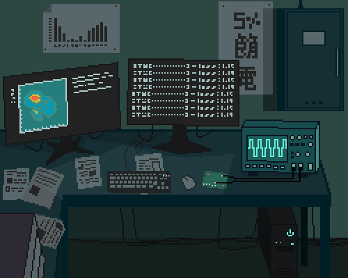

  # Hi, I am [Ajay](https://github.com/ajay0896)

## About Me
I'm a second-year **Computer Engineering** student passionate about technology and programming. I love working on projects that challenge my skills and allow me to learn new concepts.

🌍 **Location:** Bandung, Indonesia  

## ⚙️ Languages and Tools

  

         

## 📊 My Stats
<!--START_SECTION:waka-->
<!--END_SECTION:waka-->

  
  

---

Thank you for visiting my profile!